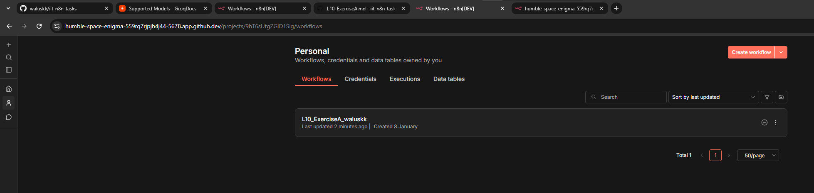
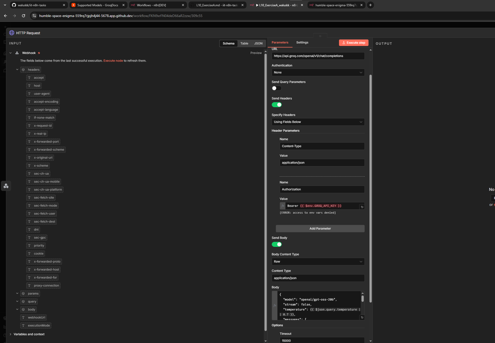
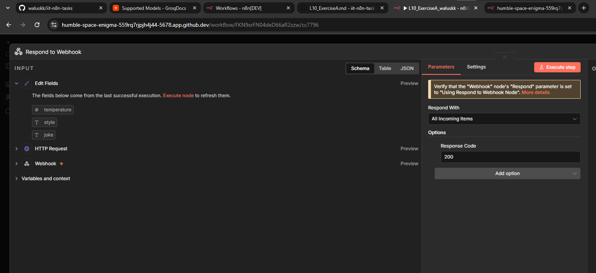
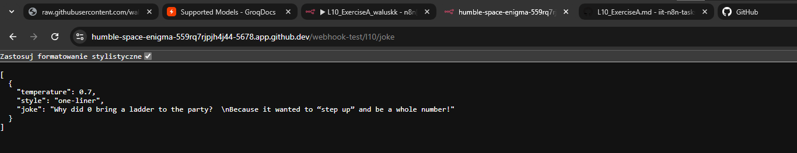

## L10 Exercise A: Solution

**1. Workflow creation**

I created a new workflow in n8n and called it `L10_ExerciseA_waluskk` according to the required naming.

**2. Webhook Setup**

I created a **Webhook node** to act as the trigger.

**Configuration:** It is set to the GET method with the path `l10/joke` and configured to wait for the **Respond to Webhook** node.

**3. HTTP API Request**

Next, I created a **HTTP Request node**.

The node calls the Groq API (OpenAI-compatible) to generate a joke. 

I configured the Authorization header to use the `{{$env.GROQ_API_KEY}}` variable and defined the JSON body with the system and user messages.

**4. Response Handling**

I added a **Set node** to structure the output data and a **Respond to Webhook node**.

This node takes the formatted JSON data (topic, style, temperature, and the generated joke) and sends it back as the HTTP response.

**Response proof**

