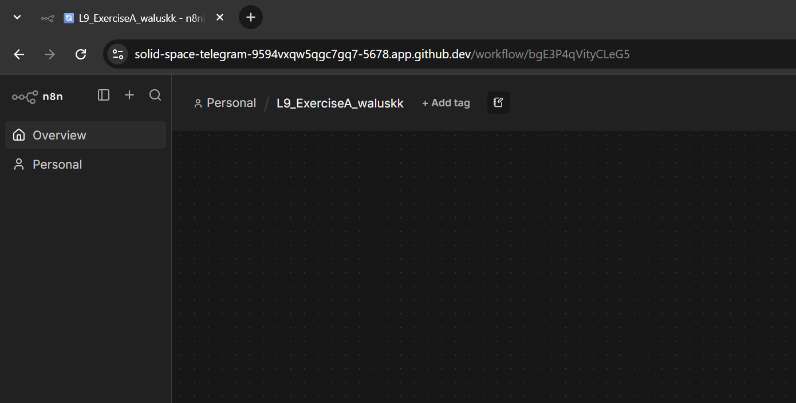
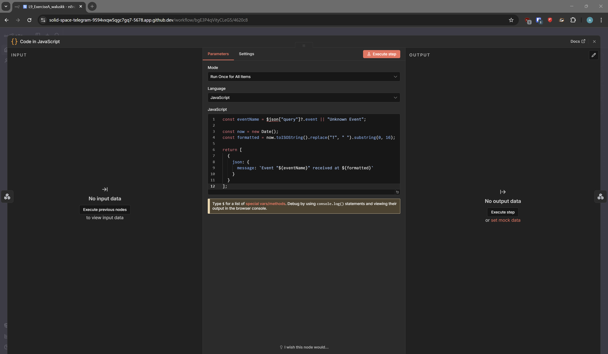
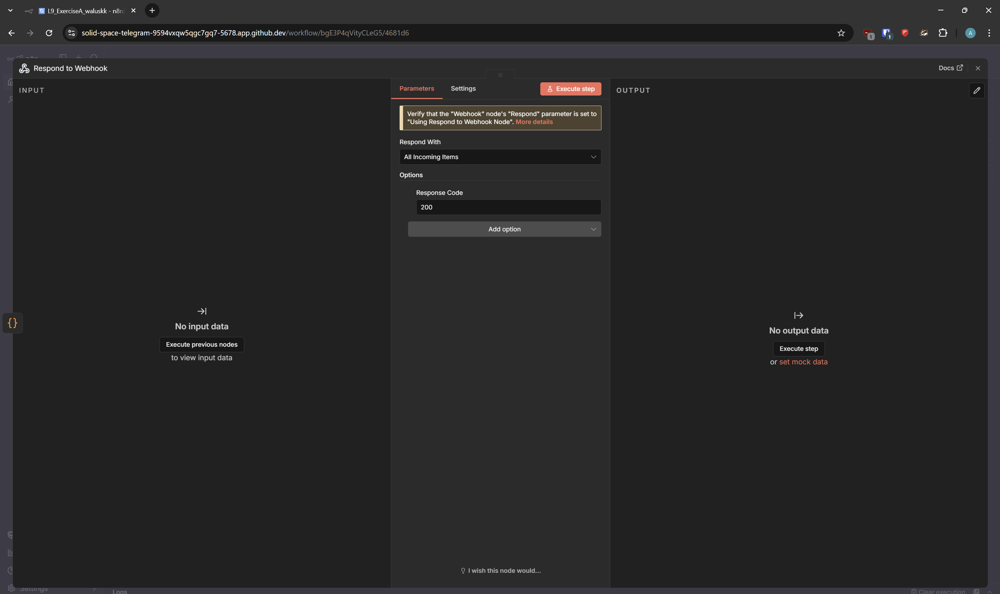
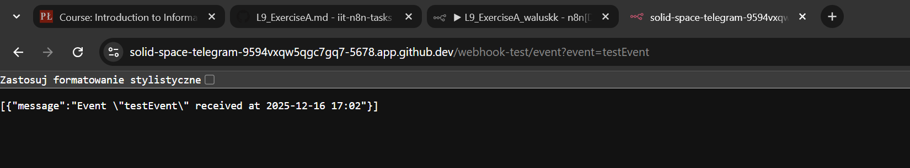

## L9 Exercise A: Solution

**1. Workflow creation**

I created a new workflow in n8n and named it according to the required naming

**2. Webhook Setup**

I created a **Webhook node** to act as the trigger.

**Configuration:** It is set to listen for a call on the webhook associated with my Codespace link

**3. Data Processing**

Next, I created a **Code node**.
The node retrieves the current date and it constructs and returns a JSON object based on the event received.

**4. Response Handling**

Finally, I added a **Respond to Webhook node**.
This node takes the JSON data generated by the Code node and sends it back as the HTTP response to the original webhook caller.

**Response proof**

