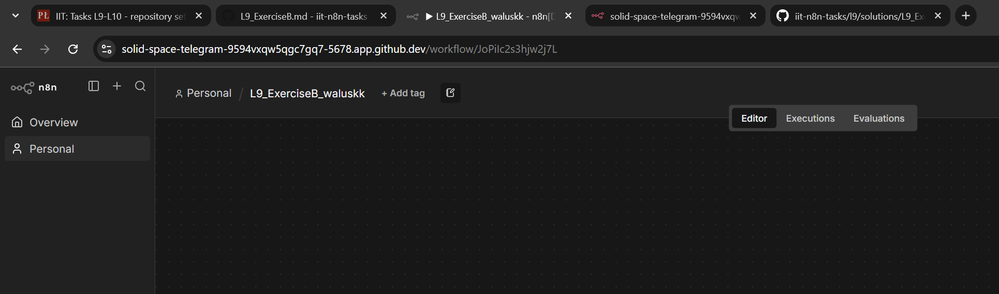
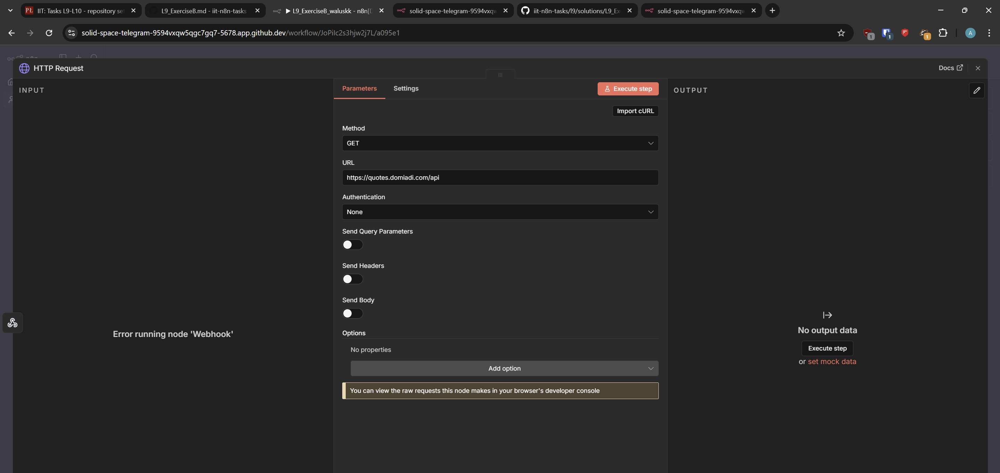
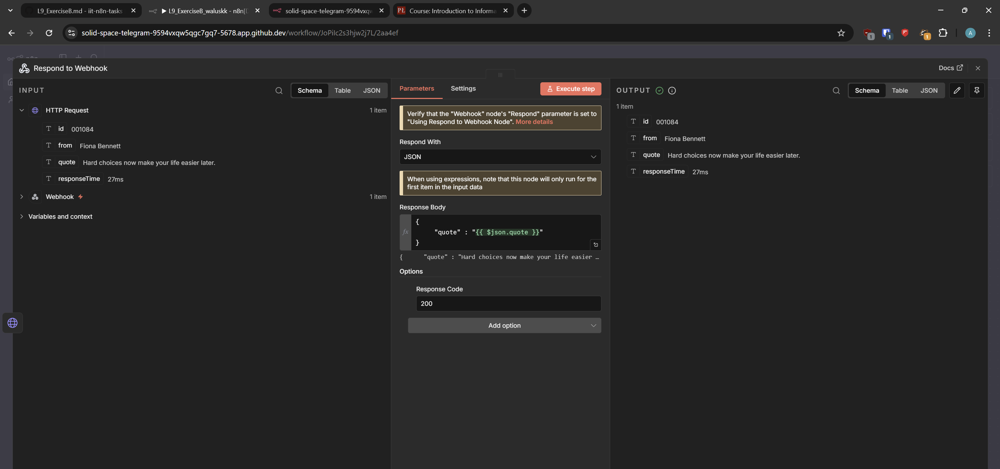
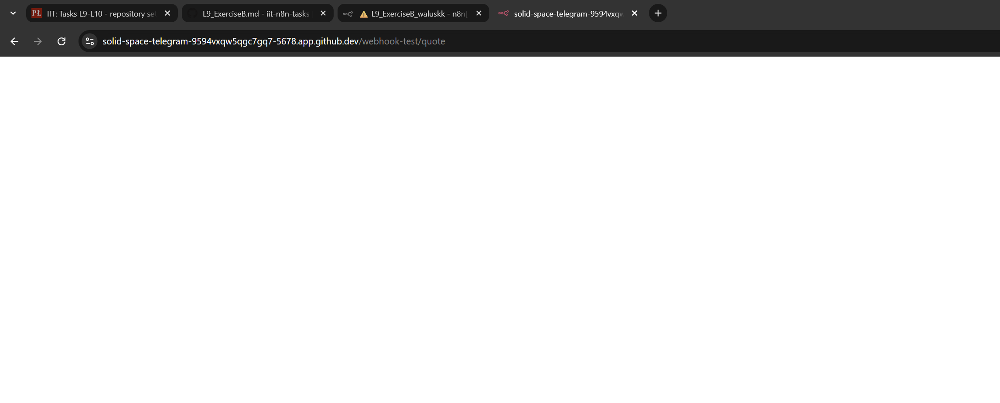

## L9 Exercise B: Solution

**1. Workflow creation**

I created a new workflow in n8n and named it according to the required naming

**2. Webhook Setup**

I created a **Webhook node** to act as the trigger.

**Configuration:** It is set to listen for a call on the test webhook associated with my Codespace link

**3. HTTP API Request**

Next, I created a **HTTP Request node**.

The node calls an external API and gets a response in JSON with a quote.

**4. Response Handling**

I added a **Respond to Webhook node**.
This node takes the JSON data returned by the API and sends it back as the HTTP response to the original webhook.

**Response proof**

