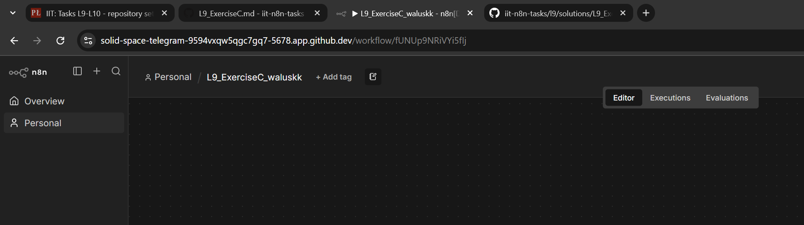
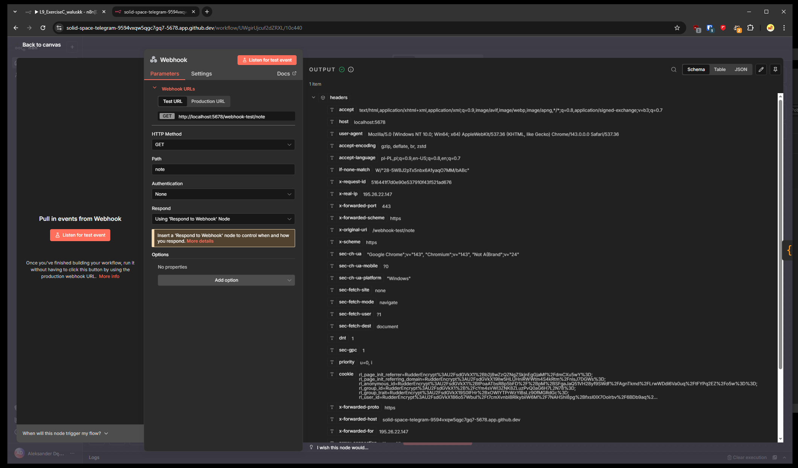
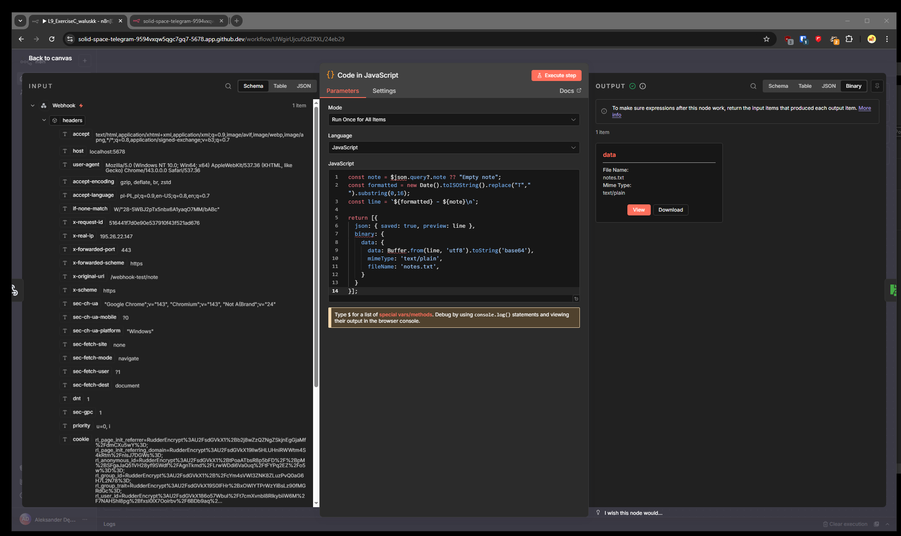
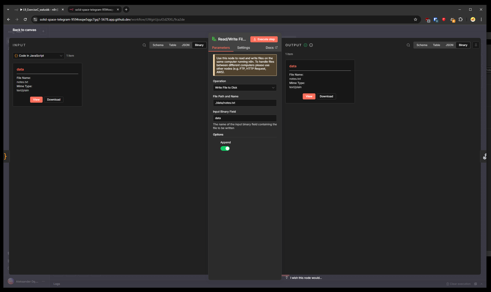
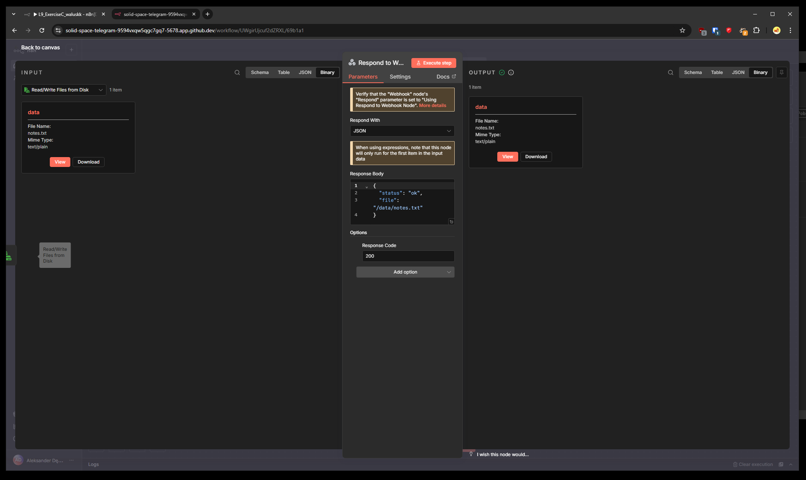
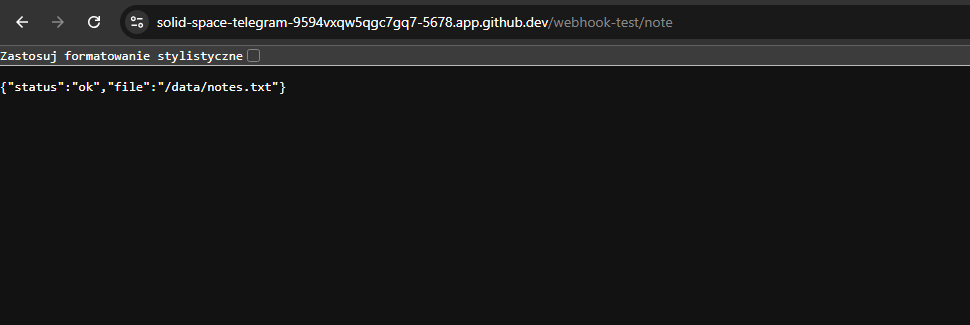
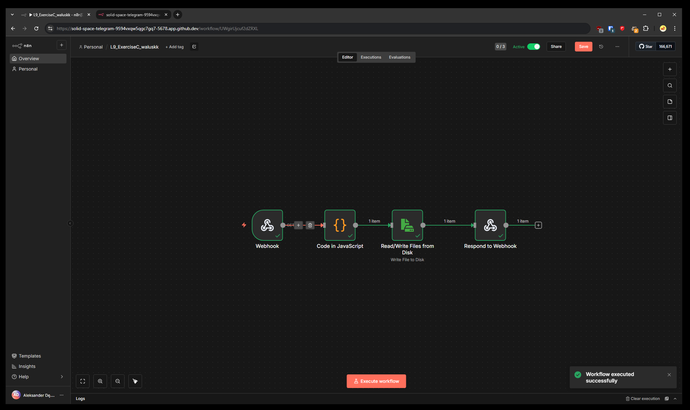
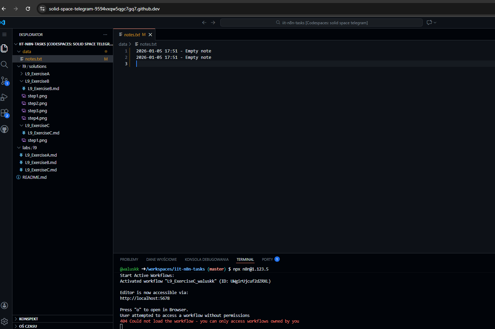

## L9 Exercise C: Solution

(solution works only on **n8n version 1.123.5**)

**1. Workflow creation**

I created a new workflow in n8n and named it according to the required naming

**2. Webhook Setup**

I created a **Webhook node** to act as the trigger.

**Configuration:** It is set to listen for a call on the test webhook associated with my Codespace link

**3. Data processing**

Next, I created a **Code node**.

The node queries any JSON data (if received) and returns a buffer called notes.txt.

**4. Write file node**

Then I created a **Read/Write files node**. 

This node gets the buffer from the previous and saves it as a local file on disk in data directory, called notes.txt.

**5. Response Handling**

I added a **Respond to Webhook node**.

This node responds success or failure of the file save procedure.

**Response proof**

**Workflow execution proof**

**File save proof**

